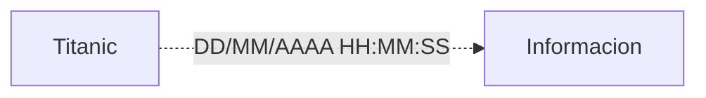
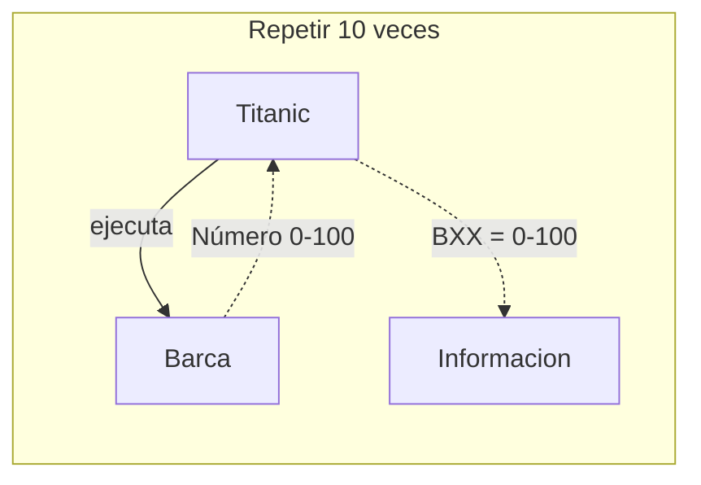
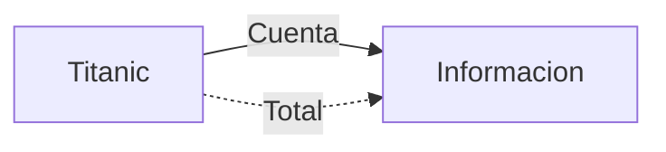

```mermaid
flowchart LR

T[Titanic]
I[Informacion]

T -. DD/MM/AAAA HH:MM:SS .-> I
```

```mermaid
flowchart LR

T[Titanic]
B[Barca]
I[Informacion]

subgraph Repetir 10 veces
    T[Titanic] --ejecuta--> B[Barca]
    B -. Número 0-100 .-> T
    T -. BXX = 0-100 .-> I[Informacion]
end
```

```mermaid
flowchart LR

T[Titanic]
I[Informacion]

T -- Cuenta --> I
T -. Total .-> I

```