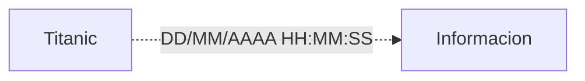
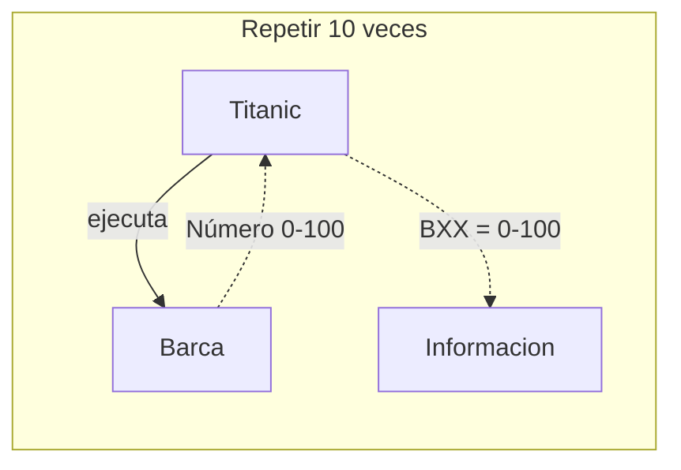
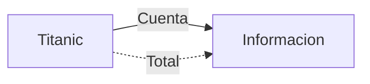
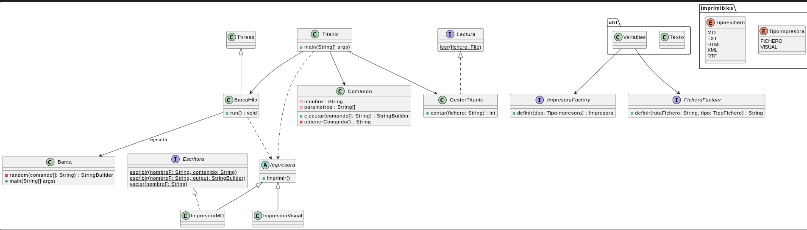
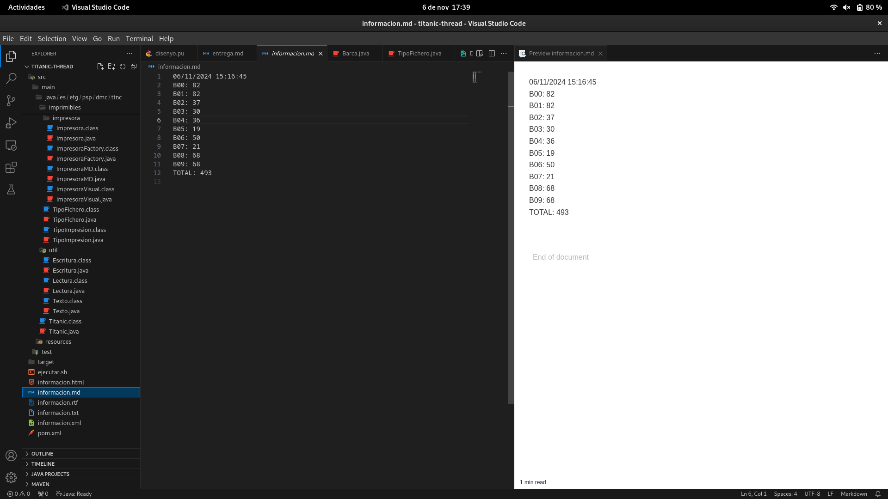
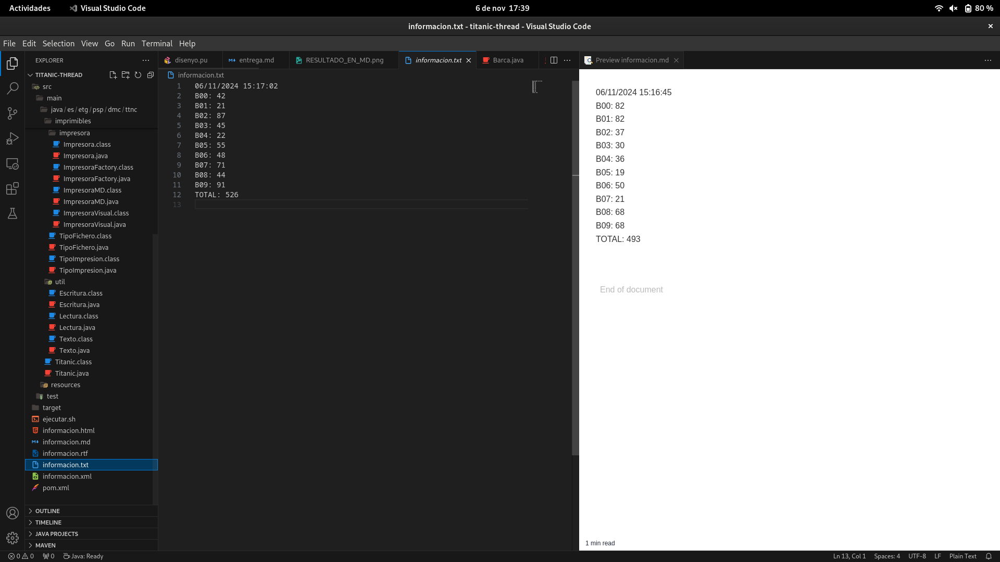

# ENTREGA DEL TITANIC

***ANÁLISIS***





***DISENYO***


```
@startuml Doc

class Titanic{
    + main(String[] args)
}

class Barca {
    - random(comando[]: String) : StringBuilder
    + main(String[] args)
}

class BarcaHilo extends Thread{
    + run() : void
}

class Comando {
    - nombre : String
    - parametros : String[]
    + ejecutar(comando[]: String) : StringBuilder
    - obtenerComando() : String
}

interface Escritura{
    {static} escribir(nombreF: String, contenido: String)
    {static} escribir(nombreF: String, output: StringBuilder)
    {static} vaciar(nombreF: String)
}

interface Lectura{
    {static} leer(fichero: File)
}

enum imprimibles.TipoImpresora {
    FICHERO
    VISUAL
}

enum imprimibles.TipoFichero {
    MD
    TXT
    HTML
    XML
    RTF
}

interface ImpresoraFactory{
    + definir(tipo: TipoImpresora) : Impresora
}

interface FicheroFactory{
    + definir(rutaFichero: String, tipo: TipoFichero) : String
}

abstract class Impresora {
    + imprimir()
}
class ImpresoraMD extends Impresora implements Escritura
class ImpresoraVisual extends Impresora

class GestorTitanic implements Lectura{
    + contar(fichero: String) : int
}

class util.Texto
class util.Variables

Variables --> FicheroFactory
Variables --> ImpresoraFactory
BarcaHilo ..> Impresora
BarcaHilo --> Barca :ejecuta
Titanic --> GestorTitanic
Titanic --> Comando
Titanic --> BarcaHilo
Titanic ..> Impresora

@enduml
```

Este proyecto escribe en un fichero las personas que se encuentran en cada barca a la hora de recogerlas y el total de estas, además de la hora de ejecución del programa:
**RESULTADO EN MD**

**RESULTADO EN TXT**

Al ejecutar la clase Titanic esta ejecuta Barca, que devolverá un número aleatorio entre 0 y 100 en un intervalo de 2 a 6 segundos, tras esto se escribirá la cantidad en un fichero seguido de "BXX:".

***TODAS LAS CLASES***
**TITANIC**
```
package es.etg.psp.dmc.ttnc;

import es.etg.psp.dmc.ttnc.comandos.Comando;
import es.etg.psp.dmc.ttnc.gestor.GestorTitanic;
import es.etg.psp.dmc.ttnc.imprimibles.fichero.FicheroFactory;
import es.etg.psp.dmc.ttnc.imprimibles.impresora.Impresora;
import es.etg.psp.dmc.ttnc.imprimibles.impresora.ImpresoraFactory;
import es.etg.psp.dmc.ttnc.util.Escritura;
import es.etg.psp.dmc.ttnc.util.Lectura;
import static es.etg.psp.dmc.ttnc.util.Texto.*;

public class Titanic implements Escritura, Lectura, ImpresoraFactory, FicheroFactory{
    public static void main(String[] args) {
        Impresora impresora = ImpresoraFactory.definir(TIPO_IMPRESORA);
        Comando comandosFecha = new Comando(COMANDO1, PARAMETROS_1);
        Comando comandosBarca = new Comando(COMANDO2, PARAMETROS_2);
        String rutaFichero = FicheroFactory.definir(TIPO_FICHERO, RUTA_FICHERO);

        Escritura.vaciar(rutaFichero);
        impresora.imprimir(rutaFichero, comandosFecha.ejecutar());

        for (int i = VALOR_INICIAL; i < VALOR_FINAL; i++) {
            if (i < MINIMO_CON_DOS_CIFRAS) 
                impresora.imprimir(rutaFichero, PREFIJO + VALOR_CERO + i + DOS_PUNTOS + ESPACIO_EN_BLANCO + comandosBarca.ejecutar());
            else 
                impresora.imprimir(rutaFichero, PREFIJO + i + DOS_PUNTOS + ESPACIO_EN_BLANCO + comandosBarca.ejecutar());
        }

        impresora.imprimir(rutaFichero, TOTAL + DOS_PUNTOS + ESPACIO_EN_BLANCO + String.valueOf(GestorTitanic.contarPersonas(rutaFichero)) + SALTO_DE_LINEA);
    }
}
```

**TEXTO**
```
package es.etg.psp.dmc.ttnc.util;

import es.etg.psp.dmc.ttnc.imprimibles.TipoFichero;
import es.etg.psp.dmc.ttnc.imprimibles.TipoImpresion;

public class Texto {
    public static final TipoImpresion TIPO_IMPRESORA = TipoImpresion.VISUAL;
    public static final TipoFichero TIPO_FICHERO = TipoFichero.RTF;

    public static final String SEPARADOR = ";;";
    public static final String MSG_ERROR_ENCONTRAR_F = "NO SE HA ENCONTRADO EL FICHERO";
    public static final String VACIO = "";
    public static final String ESPACIO_EN_BLANCO = " ";
    public static final String MSG_ERROR_STR_ENTERO = "HA OCURRIDO UN ERROR AL PASAR A ENTERO";
    public static final String CERO = "0";
    public static final String MSG_ERR_THREAD = "SE HA INTERRUMPIDO EL THREAD";
    public static final String TOTAL = "TOTAL";
    public static final String PREFIJO = "B";
    public static final String DOS_PUNTOS = ":";
    public static final String COMANDO1 = "date";
    public static final String PARAMETRO_1_1 = "+%d/%m/%Y %H:%M:%S";
    public static final String[] PARAMETROS_1 = {PARAMETRO_1_1};
    public static final String COMANDO2 = "java";
    public static final String PARAMETRO_2_1 = "es.etg.psp.dmc.ttnc.brc.Barca";
    public static final String[] PARAMETROS_2 = {PARAMETRO_2_1};
    public static final String RUTA_FICHERO = "./../../../informacion";
    public static final String SALTO_DE_LINEA = "\n";
	public static final String MSG_ERROR = "Se ha producido un error al ejecutar el comando";
    public static final String MSG_ERROR_ESCRITURA_FICHERO = "HA OCURRIDO UN ERROR AL ESCRIBIR EL FICHERO: ";
    public static final String MSG_ERROR_VACIAR = "HA OCURRIDO UN ERROR AL VACIAR EL FICHERO";

    public static final int INICIO_BARCAS_TOTAL = 1;
    public static final int VALOR_CERO = 0;
    public static final int VALOR_FINAL = 10;
    public static final int MULTIPLICADOR_MILISEC = 100;
    public static final int MAX_TIEMPO_EJEC = 6;
    public static final int MIN_TIEMPO_EJEC = 2;
    public static final int MAX_PASAJEROS = 100;
    public static final int MIN_PASAJEROS = 0;
    public static final int VALOR_NUMERICO_COMANDO = 1;
    public static final int MINIMO_CON_DOS_CIFRAS = 10;
    public static final int VALOR_INICIAL = 0;
}
```

**VARIABLES**
```
package es.etg.psp.dmc.ttnc.util;

import es.etg.psp.dmc.ttnc.comandos.Comando;
import es.etg.psp.dmc.ttnc.imprimibles.fichero.FicheroFactory;
import es.etg.psp.dmc.ttnc.imprimibles.impresora.Impresora;
import es.etg.psp.dmc.ttnc.imprimibles.impresora.ImpresoraFactory;
import static es.etg.psp.dmc.ttnc.util.Texto.*;

public class Variables {
    public static final Impresora impresora = ImpresoraFactory.definir(TIPO_IMPRESORA);
    public static final Comando comandosFecha = new Comando(COMANDO1, PARAMETROS_1);
    public static final Comando comandosBarca = new Comando(COMANDO2, PARAMETROS_2);
    public static final String rutaFichero = FicheroFactory.definir(TIPO_FICHERO, RUTA_FICHERO);
}
```

**LECTURA**
```
package es.etg.psp.dmc.ttnc.util;

import java.io.File;
import java.io.FileNotFoundException;
import java.util.Scanner;
import static es.etg.psp.dmc.ttnc.util.Texto.*;

public interface Lectura {

    static String leer(File fichero) {
        String contenido = VACIO;
        try (Scanner sc = new Scanner(fichero)){
            while (sc.hasNextLine()) {
                contenido += sc.nextLine() + SEPARADOR;
            }
        } catch (FileNotFoundException e) {
            System.err.println(MSG_ERROR_ENCONTRAR_F);
        }
        return contenido;
    }
}
```

**ESCRITURA**
```
package es.etg.psp.dmc.ttnc.util;

import java.io.FileOutputStream;
import java.io.IOException;
import static es.etg.psp.dmc.ttnc.util.Texto.*;

public interface Escritura {

    static void escribir(String rutaFichero, StringBuilder output) {
        escribir(rutaFichero, output.toString());
    }

    static void escribir(String rutaFichero, String contenido) {
        try (FileOutputStream fos = new FileOutputStream(rutaFichero, true)) {
            String datos = contenido;
            byte[] byteArray = datos.getBytes();
            fos.write(byteArray);
        } catch (IOException e) {
            System.out.println(MSG_ERROR_ESCRITURA_FICHERO + e.getMessage());
        }
    }

    static void vaciar(String rutaFichero) {
        try (FileOutputStream fos = new FileOutputStream(rutaFichero)) { 
            
        } catch (IOException e) {
            System.err.println(MSG_ERROR_VACIAR + e.getMessage());
        }
    }
}
```

**TIPO IMPRESIÓN**
```
package es.etg.psp.dmc.ttnc.imprimibles;

public enum TipoImpresion {
    FICHERO,
    VISUAL
}
```

**TIPO FICHERO**
```
package es.etg.psp.dmc.ttnc.imprimibles;

public enum TipoFichero {
    TXT,
    MD,
    HTML,
    RTF,
    XML
}
```

**IMPRESORA**
```
package es.etg.psp.dmc.ttnc.imprimibles.impresora;

public abstract class Impresora {
    public abstract void imprimir(String rutaFichero, String contenido);
}
```

**IMPRESORA MD**
```
package es.etg.psp.dmc.ttnc.imprimibles.impresora;

import es.etg.psp.dmc.ttnc.util.Escritura;

public class ImpresoraMD extends Impresora implements Escritura{
    @Override
    public void imprimir(String rutaFichero, String contenido) {
        Escritura.escribir(rutaFichero, contenido);
    }

}
```
**IMPRESORA VISUAL**
```
package es.etg.psp.dmc.ttnc.imprimibles.impresora;

import es.etg.psp.dmc.ttnc.util.Escritura;

public class ImpresoraVisual extends Impresora{

    @Override
    public void imprimir(String rutaFichero, String contenido) {
        Escritura.escribir(rutaFichero, contenido);
        System.out.print(contenido);
    }

}
```

**IMPRESORA FACTORY**
```
package es.etg.psp.dmc.ttnc.imprimibles.impresora;

import es.etg.psp.dmc.ttnc.imprimibles.TipoImpresion;

public interface ImpresoraFactory {

    static Impresora definir(TipoImpresion tipo){
        if (tipo == TipoImpresion.FICHERO) {
            return new ImpresoraMD();
        } else {
            return new ImpresoraVisual();
        }
    }

}
```

**FICHERO FACTORY**
```
package es.etg.psp.dmc.ttnc.imprimibles.fichero;
import es.etg.psp.dmc.ttnc.imprimibles.TipoFichero;

public interface FicheroFactory {

    public static final String ENLACE_NOMBRE_EXTENSION = ".";
    public static final String HTML = "html";
    public static final String XML = "xml";
    public static final String RTF = "rtf";
    public static final String TXT = "txt";
    public static final String MD = "md";

    static String definir(TipoFichero tipo, String rutaFichero){
        if (tipo == TipoFichero.MD) {
            return rutaFichero + ENLACE_NOMBRE_EXTENSION + MD;
        } else if (tipo == TipoFichero.TXT){
            return rutaFichero + ENLACE_NOMBRE_EXTENSION + TXT;
        } else if (tipo == TipoFichero.RTF) {
            return rutaFichero + ENLACE_NOMBRE_EXTENSION + RTF;
        } else if (tipo == TipoFichero.XML) {
            return rutaFichero + ENLACE_NOMBRE_EXTENSION + XML;
        } else {
            return rutaFichero + ENLACE_NOMBRE_EXTENSION + HTML;
        }
    }

}
```

**GESTOR TITANIC**
```
package es.etg.psp.dmc.ttnc.gestor;

import java.io.File;

import es.etg.psp.dmc.ttnc.util.Lectura;
import es.etg.psp.dmc.ttnc.util.Escritura;
import static es.etg.psp.dmc.ttnc.util.Texto.*;

public class GestorTitanic implements Escritura, Lectura{

    public static int contarPersonas(String rutaFichero){
        int total = VALOR_CERO;
        String contenido[] = Lectura.leer(new File(rutaFichero)).split(SEPARADOR);
        
        try {
            for (int i = INICIO_BARCAS_TOTAL; i <= VALOR_FINAL; i++) {
                total += Integer.parseInt(contenido[i].substring(contenido[i].length() - 2));
            }
        } catch (Exception e) {
            System.err.println(MSG_ERROR_STR_ENTERO);
        }

        return total;
    }
}
```

**COMANDO**
```
package es.etg.psp.dmc.ttnc.comandos;

import java.io.BufferedReader;
import java.io.IOException;
import java.io.InputStreamReader;

import static es.etg.psp.dmc.ttnc.util.Texto.*;

public class Comando{
    private String nombre = ESPACIO_EN_BLANCO;
    private String[] parametros;
    
    public Comando(String nombre, String[] parametros) {
        this.nombre = nombre;
        this.parametros = parametros;
    }

    public String ejecutar(){
        String salida = VACIO;
        try {
            Process process = Runtime.getRuntime().exec(obtenerComando());

            StringBuilder output = new StringBuilder();
            BufferedReader reader = new BufferedReader(new InputStreamReader(process.getInputStream()));
            String line;
            while ((line = reader.readLine()) != null) {
                output.append(line).append(SALTO_DE_LINEA);
            }

            int exitVal = process.waitFor();
            if (exitVal != 0) {
                System.out.println(MSG_ERROR);
                System.exit(1);
            }
            salida = output.toString();

        } catch (IOException | InterruptedException e) {
            System.exit(34);
        }
        return salida;
    }

    private String[] obtenerComando(){
        String[] comando = new String[this.parametros.length + VALOR_NUMERICO_COMANDO];
        comando[VALOR_CERO] = this.nombre;
        for (int i = VALOR_NUMERICO_COMANDO; i <= parametros.length; i++) {
            comando[i] = parametros[i-VALOR_NUMERICO_COMANDO];
        }
        return comando;
    }

    public String getNombre() {
        return nombre;
    }

    public String[] getParametros() {
        return parametros;
    }

    public void setNombre(String nombre) {
        this.nombre = nombre;
    }

    public void setParametros(String[] parametros) {
        this.parametros = parametros;
    }

}
```

**BARCA**
```
package es.etg.psp.dmc.ttnc.brc;
import static es.etg.psp.dmc.ttnc.util.Texto.*;

import java.util.Random;

public class ProgramaBarca {
    public static void main(String[] args) {
        int pasajeros = random(MIN_PASAJEROS,MAX_PASAJEROS);
        int threadMiliseconds = random(MIN_TIEMPO_EJEC_MILISEC,MAX_TIEMPO_EJEC_MILISEC);

        try {
            Thread.sleep(threadMiliseconds);
        } catch (InterruptedException e) {
            System.err.println(MSG_ERR_THREAD);
        }

        System.out.print((pasajeros < 10)? CERO + pasajeros : pasajeros);
    }

    private static int random(int menor, int mayor){
        Random random = new Random();
        return menor + random.nextInt(mayor-1);
    }
}
```

**BARCA HILO**
```
package es.etg.psp.dmc.ttnc.brc;

import static es.etg.psp.dmc.ttnc.util.Texto.*;
import es.etg.psp.dmc.ttnc.util.Lectura;

import static es.etg.psp.dmc.ttnc.util.Variables.*;

import java.io.File;

public class BarcaHilo extends Thread implements Lectura{    
    public void run() {
        String respuesta = comandosBarca.ejecutar();
        int numeroLinea = Lectura.contarLineas(new File(rutaFichero));
        impresora.imprimir(rutaFichero, PREFIJO + ((numeroLinea < 10)? CERO + numeroLinea : numeroLinea )+ DOS_PUNTOS + ESPACIO_EN_BLANCO + respuesta);
    }
}
```